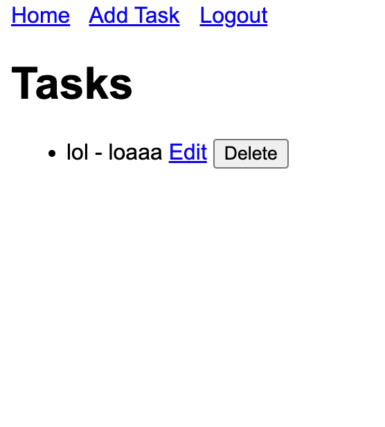
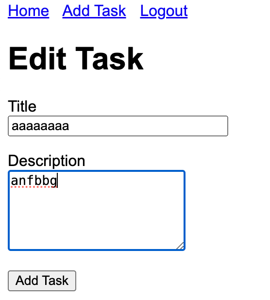

# todoapp

basically a todo app i made to practice some python flask and docker, more details can be found on my blog post at

[http://blog.johnamata.com/hacking](http://blog.johnamata.com/hacking)

Go to the search bar, type:

`monomyth todo app` or `monomyth todoapp`

# run locally

1. activate virtual environment

```
$ source venv/bin/activate
```

2. install depdencnies

```
$ pip install -r requirements.txt
```

3. run flask app then go to `http://127.0.0.1:5000`

```
$ flask run
```

# run with docker

1. build docker image

```
$ docker-compose build
```

2. run docker container then go to `localhost:5001`

```
$ docker-compose up
```

# screenshots



